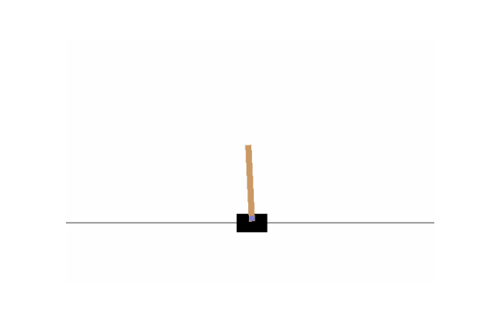
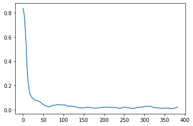

# drlearn 
Deep Reinforcement Learning implementation

## Installation
Normal user:
```bash
git clone https://github.com/Javicadserres/drlearn.git
pip install drlearn/.
```

alternatively:
```bash
git clone https://github.com/Javicadserres/drlearn.git
pip install drlearn/. -r drlearn/requirements.txt
```

## Usage

Example game *'CartPole-v1'*



Import libraries
```python
from __future__ import print_function

import gym
import numpy as np
import matplotlib.pyplot as plt

from dnetworks.model import NNet
from dnetworks.layers import LinearLayer, LeakyReLU, MSELoss
from dnetworks.optimizers import Adam
from drlearn import DRLearn
from drlearn.utils import Memory

def play_game(model_rl, n_epochs=10):
    """
    Plays a game.
    """
    for epoch in range(n_epochs):
        state = model_rl.env.reset()
        total_reward = 0
        while True:
            model_rl.env.render()
            state = state.reshape(model_rl.n_states, 1)
            _action = model_rl.model.forward(state).T
            action = np.argmax(_action, axis=1)[0]
            state, reward, done, _ = model_rl.env.step(action)
            total_reward += reward
            if done: break
        print ("%d Reward: %s" % (epoch, total_reward))

    model_rl.env.close()

env_name = 'CartPole-v1'

# Initialize the environment
gym_env = gym.make(env_name)
n_states = gym_env.observation_space.shape[0]
n_actions = gym_env.action_space.n

model = NNet()

# Create the model structure
model.add(LinearLayer(n_states, 64))
model.add(LeakyReLU())

model.add(LinearLayer(64, 32))
model.add(LeakyReLU())

model.add(LinearLayer(32, 8))
model.add(LeakyReLU())

model.add(LinearLayer(8, n_actions))


# set the loss functions and the optimize method
loss = MSELoss()
optim = Adam(lr=0.001)
memory = Memory(capacity=300, sample_size=32)

dqn = DRLearn(
    model=model,
    optim=optim,
    loss=loss,
    env=gym_env,
    memory=memory,
    epsilon=0.9, 
    gamma=0.8, 
    decay_rate=0.005,
    min_epsilon=0.1
)

n_epochs = 1000
epoch_losses = []
max_reward = 0

for epoch in range(n_epochs):
    epoch_loss, total_reward = dqn.play()
    max_reward = max(max_reward, total_reward)
    dqn.update_epsilon(epoch=epoch)
    epoch_losses.append(epoch_loss)

    if epoch % 100 == 0:
        print('loss: ', epoch_loss, 'max reward: ', max_reward, 'epoch: ', epoch)
        
    if max_reward == 500:
        break

plt.plot(np.convolve(epoch_losses, np.ones(20), 'valid') / 20)
plt.show()
```



```python
play_game(model_rl=dqn, n_epochs=1)
```

